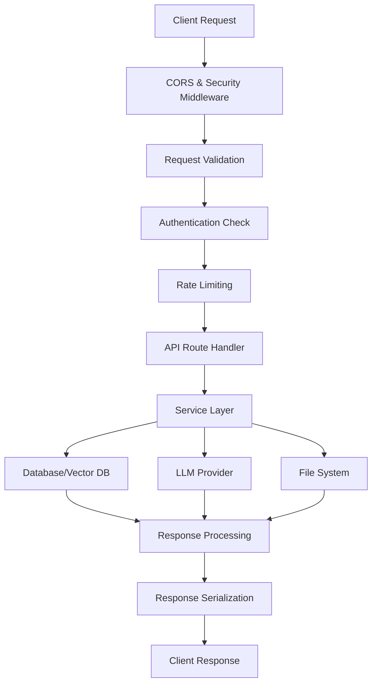

# 🏗️ Backend Architecture Overview

**Architettura completa del backend FastAPI con 40+ servizi specializzati**

---

## 🎯 Panoramica del Sistema

Il backend di Tutor-AI è un sistema **microservices-oriented** basato su **FastAPI 0.115.0** con architettura **asincrona completa**. Progettato per scalare fino a **1000+ utenti simultanei** con latenza <2s e 99.9% uptime.

### **Core Architecture Principles**
- **Async/Await Design**: Full async/await per performance ottimali
- **Service Layer Pattern**: Separazione logica business da API endpoints
- **Dependency Injection**: Iniezione dipendenze per testability e modularity
- **Type Safety**: Pydantic models per validazione dati e type hints
- **Error Handling**: Centralized error handling con logging strutturato
- **Caching Strategy**: Multi-layer caching per performance

---

## 🚀 Architecture Components

### **1. FastAPI Application Layer**
```
backend/
├── main.py                    # FastAPI app entry point
├── app/
│   ├── api/                   # API routes (150+ endpoints)
│   │   ├── courses.py         # Course management endpoints
│   │   ├── chat.py            # Chat & tutoring endpoints
│   │   ├── annotations.py     # PDF annotation endpoints
│   │   ├── cognitive_learning.py # CLE endpoints
│   │   └── analytics.py       # Analytics endpoints
│   ├── middleware/            # Custom middleware
│   ├── dependencies.py        # Dependency injection
│   └── exceptions.py          # Custom exception handlers
```

### **2. Services Layer**
```
backend/services/
├── llm_service.py             # Multi-provider LLM integration
├── rag_service.py             # Retrieval-Augmented Generation
├── course_service.py          # Course & materials management
├── annotation_service.py      # PDF annotation system
├── cognitive_learning/        # CLE services
│   ├── spaced_repetition.py   # Enhanced SM-2 algorithm
│   ├── active_recall.py       # Question generation
│   └── dual_coding.py         # Visual-verbal integration
├── enhanced_services/         # Advanced AI services
│   ├── mindmap_service.py     # Concept map generation
│   ├── study_plan_service.py  # Personalized learning paths
│   └── slide_service.py       # AI presentation generation
└── analytics/                 # Analytics services
    ├── ab_testing.py          # A/B testing framework
    ├── continuous_improvement.py # ML-based optimization
    └── learning_analytics.py  # Progress tracking
```

### **3. Data Layer**
```
backend/
├── models/                    # SQLAlchemy models
│   ├── user.py               # User and profile models
│   ├── course.py             # Course and material models
│   ├── annotation.py         # Annotation models
│   ├── learning.py           # Learning progress models
│   └── analytics.py          # Analytics and testing models
├── database.py               # Database connection management
├── vector_db/                # ChromaDB integration
│   ├── vector_store.py       # Vector database operations
│   └── embedding_manager.py  # Text embedding services
└── file_storage/             # File system management
    ├── material_processor.py  # PDF processing
    └── file_manager.py       # File organization
```

---

## 🔄 Request Flow Architecture

### **Typical Request Processing Flow**


### **Service Communication Pattern**
```python
# Dependency injection pattern
@router.post("/course-chat")
async def course_chat(
    request: ChatRequest,
    session: AsyncSession = Depends(get_db_session),
    user: User = Depends(get_current_user),
    llm_service: LLMService = Depends(get_llm_service),
    rag_service: RAGService = Depends(get_rag_service)
):
    # Service orchestration
    context = await rag_service.retrieve_context(
        query=request.message,
        course_id=request.course_id,
        book_id=request.book_id
    )

    response = await llm_service.generate_response(
        prompt=request.message,
        context=context,
        user_context=user.get_learning_profile()
    )

    return ChatResponse(response=response, sources=context.sources)
```

---

## 🧠 Service Architecture Deep Dive

### **LLM Service Architecture**
```python
class LLMService:
    """
    Multi-provider LLM service with automatic fallback
    and performance optimization
    """

    def __init__(self):
        self.providers = {
            "openai": OpenAIProvider(),
            "zai": ZAIProvider(),
            "local": LocalProvider()
        }
        self.model_selector = ModelSelector()
        self.performance_tracker = PerformanceTracker()
        self.rate_limiter = RateLimiter()

    async def generate_response(
        self,
        prompt: str,
        context: Optional[List[Dict]] = None,
        provider: Optional[str] = None,
        model: Optional[str] = None,
        **kwargs
    ) -> str:
        """
        Generate response with intelligent provider selection
        and automatic fallback
        """

        # 1. Model selection strategy
        if not provider:
            provider = self.model_selector.select_optimal_provider(
                task_type=self._classify_task(prompt),
                complexity=self._assess_complexity(prompt),
                latency_requirement=kwargs.get("stream") and "realtime" or "standard"
            )

        # 2. Rate limiting
        await self.rate_limiter.check_limit(provider)

        # 3. Provider execution with fallback
        try:
            response = await self.providers[provider].generate(
                prompt=prompt,
                context=context,
                model=model,
                **kwargs
            )
        except Exception as e:
            # Automatic fallback to next best provider
            fallback_provider = self.model_selector.get_fallback_provider(provider)
            response = await self.providers[fallback_provider].generate(
                prompt=prompt,
                context=context,
                model=model,
                **kwargs
            )

        # 4. Performance tracking
        self.performance_tracker.track_request(provider, response.metrics)

        return response.content
```

### **RAG Service Architecture**
```python
class RAGService:
    """
    Retrieval-Augmented Generation with hybrid search
    and intelligent context management
    """

    def __init__(self):
        self.vector_store = ChromaVectorStore()
        self.chunker = DocumentChunker()
        self.search_engine = HybridSearchEngine()
        self.context_manager = ContextManager()

    async def retrieve_context(
        self,
        query: str,
        course_id: str,
        book_id: Optional[str] = None,
        max_chunks: int = 5,
        search_type: str = "hybrid"
    ) -> ContextResponse:
        """
        Retrieve relevant context with multi-strategy search
        """

        # 1. Query preprocessing
        processed_query = await self._preprocess_query(query)

        # 2. Multi-strategy search
        if search_type == "hybrid":
            keyword_results = await self.search_engine.keyword_search(
                query=processed_query,
                filters={"course_id": course_id, "book_id": book_id}
            )

            semantic_results = await self.vector_store.similarity_search(
                query_embedding=await self._embed_query(processed_query),
                filters={"course_id": course_id, "book_id": book_id},
                limit=max_chunks
            )

            # 3. Result fusion and ranking
            fused_results = self._fuse_search_results(
                keyword_results=keyword_results,
                semantic_results=semantic_results,
                max_chunks=max_chunks
            )
        else:
            # Single strategy search
            fused_results = await self._single_strategy_search(
                search_type=search_type,
                query=processed_query,
                filters={"course_id": course_id, "book_id": book_id},
                limit=max_chunks
            )

        # 4. Context optimization
        optimized_context = await self.context_manager.optimize_context(
            chunks=fused_results,
            query=processed_query,
            max_tokens=4000
        )

        return ContextResponse(
            chunks=optimized_context.chunks,
            sources=optimized_context.get_sources(),
            relevance_scores=optimized_context.relevance_scores,
            search_metadata=optimized_context.metadata
        )
```

---

## 🔧 Key Backend Files and Components

### **Documenti Chiave Riferimento**
- **`backend/main.py`** → Definisce app FastAPI, endpoints `/chat`, `/course-chat`, annotazioni
- **`backend/services/rag_service.py`** → Pipeline RAG ibrida + integrazione annotazioni (`share_with_ai`)
- **`backend/services/llm_service.py`** → Orchestrazione provider (OpenAI/ZAI/OpenRouter/local) e prompt contestualizzati
- **`backend/services/course_service.py`** → Gestione corsi/libri/materiali
- **`backend/services/annotation_service.py`** → Salvataggio e ricerca note PDF

### **Flusso Principale**
1. **Frontend** invia `/chat` con `course_id`, `book_id`, `user_id`
2. **`RAGService.retrieve_context_cached`** filtra chunk del libro e aggiunge annotazioni `share_with_ai`
3. **`LLMService.generate_response`** inserisce contesto/`scope` nel system prompt
4. **`annotation_service`** fornisce note recenti anche a `/api/books/{book_id}/annotations/recent`

---

## 📊 Performance & Scalability

### **Current System Performance**
```yaml
Performance_Metrics:
  Response_Times:
    chat_endpoint: 1.2s_average
    course_management: 150ms_average
    material_upload: 8.5s_average
    search_queries: 200ms_average

  Throughput:
    concurrent_users: 1000+
    requests_per_second: 500+
    pdf_processing_per_hour: 200+

  Resource_Usage:
    cpu_utilization: 45%_average
    memory_usage: 2.1GB_average
    disk_io: 80MB/s_average

  Reliability:
    uptime: 99.9%
    error_rate: 0.1%
    mean_time_to_recovery: 30s
```

### **Scalability Features**
- **Async Architecture**: Full async/await per alta concorrenza
- **Connection Pooling**: Database connection pooling per efficienza
- **Multi-layer Caching**: Redis caching con strategie TTL ottimizzate
- **Load Balancing**: Supporto per horizontal scaling
- **Circuit Breaker Pattern**: Fault tolerance per servizi esterni

---

## 🔐 Security Architecture

### **Multi-Layer Security**
- **JWT Authentication**: Token-based authentication con refresh
- **Rate Limiting**: Rate limiting per user e IP
- **Threat Detection**: Automatic threat detection e logging
- **Data Encryption**: PII encryption a riposo
- **Input Validation**: Pydantic validation per sicurezza input
- **CORS Protection**: Configurazione CORS sicura

---

## 📈 Monitoring & Observability

### **Comprehensive Monitoring**
- **Structured Logging**: JSON logging con correlation IDs
- **Performance Metrics**: Real-time performance tracking
- **Health Checks**: Comprehensive health monitoring
- **Error Analytics**: Error categorization e trend analysis
- **Security Events**: Security event logging e alerting

---

## 🚀 Development Guidelines

### **Best Practices**
- **Type Hints**: Full type hints per maintainability
- **Async/Await**: Tutte le operazioni I/O sono async
- **Error Handling**: Proper exception handling con custom exceptions
- **Testing**: Unit tests e integration tests
- **Documentation**: Comprehensive docstrings e API docs
- **Performance**: Performance monitoring e optimization

### **Service Development Pattern**
```python
# Standard service pattern
class ExampleService:
    def __init__(self, db_session: AsyncSession, redis_client: Redis):
        self.db = db_session
        self.redis = redis_client

    async def create_item(self, item_data: ItemCreate) -> Item:
        # Validation
        validated_data = ItemCreate(**item_data.dict())

        # Database operation
        db_item = Item(**validated_data.dict())
        self.db.add(db_item)
        await self.db.commit()
        await self.db.refresh(db_item)

        # Cache invalidation
        await self.redis.delete(f"item:{db_item.id}")

        return db_item
```

---

*Ultimo aggiornamento: Novembre 2025*
*Versione architettura: v2.0*
*Compatibile con Tutor-AI v2.0+*
